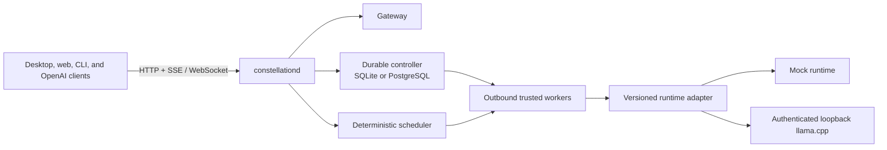

# Constellation

[](https://github.com/ZShamsi987/Constellation/actions/workflows/ci.yml)
[](LICENSE)
[](IMPLEMENTATION_STATUS.md)

> Turn every computer you control into one private AI supercomputer.

Constellation is a local-first control plane for running AI workloads across computers you trust. It inventories hardware, measures runtimes and links, chooses an execution plan, explains that choice, and exposes the cluster through an OpenAI-compatible API.

It does not require a cloud account, relay, Docker installation, or internet connection for normal local operation.

> [!WARNING]
> Constellation is pre-release software (`0.1.0-alpha.1`). Local and trusted-worker flows are executable, but the project is not production-ready until signed packages and the physical tier-1 acceptance matrix pass. Remote transport and real distributed inference remain disabled behind explicit release gates.

## Why Constellation?

- **Private by default.** Local-only networking, disabled telemetry, no prompt logging, and explicit opt-ins for cloud, relay, and content persistence.
- **One endpoint for mixed hardware.** CPU, Metal, CUDA, HIP, and Vulkan capabilities can be normalized behind versioned runtime adapters.
- **Plans you can inspect.** Every placement records constraints, estimates, alternatives, confidence, privacy path, and replanning triggers.
- **Safe failure semantics.** Unsupported features fail explicitly; interrupted generations are never mislabeled as resumed.
- **Useful without a cluster.** The default daemon runs controller and worker roles together on one machine.

## What works today

| Area | Current alpha |
| --- | --- |
| Control plane | Rust daemon with controller, worker, or combined roles; SQLite locally and PostgreSQL for server deployments |
| Runtime layer | Deterministic mock runtime, supervised loopback-only llama.cpp adapter, and a pinned EXO integration boundary |
| API | Responses, Chat Completions, Completions, Embeddings, Models, SSE streaming, cancellation, normalized errors, and trace IDs |
| Trusted nodes | Expiring enrollment, administrator approval, device identity, rotating certificates, outbound worker leases, revocation, and local resource policy |
| Product UI | Shared React dashboard with a Tauri 2 desktop shell, Simple and Engineering modes, plans, privacy paths, workflows, teams, and diagnostics |
| Scheduling | Deterministic constraint-first placement, replicas and independent routing, model-fit checks, observations, and digital-twin simulation |
| Extensibility | Durable workflow engine and deny-by-default Wasmtime Component Model plugin host |

See [Implementation Status](IMPLEMENTATION_STATUS.md) for executable evidence and the gates that remain closed.

## Architecture



`constellationd --role all` is the normal first-node installation. Additional machines use `--role worker`. The scheduler is a pure Rust library with no I/O; the UI is never trusted to enforce security rules.

Read [Architecture](ARCHITECTURE.md), [Threat Model](THREAT_MODEL.md), and [Privacy Model](PRIVACY_MODEL.md) for the full design.

## Run locally

### Prerequisites

- Rust 1.97.1
- Node.js 24 LTS
- pnpm 11
- Git and `just`

The repository pins these versions in `rust-toolchain.toml`, `.node-version`, `.python-version`, and `package.json`.

### 1. Install dependencies

```bash
corepack enable
pnpm install
```

### 2. Start the daemon

```bash
cargo run -p constellationd -- \
  --role all \
  --database-url 'sqlite://constellation.db?mode=rwc'
```

The API listens on `http://127.0.0.1:4317`.

### 3. Start the dashboard

In a second terminal:

```bash
pnpm --filter @constellation/web dev
```

Open [http://127.0.0.1:5173](http://127.0.0.1:5173). Keep the daemon running; the dashboard needs its API and event stream.

### Native desktop shell

Start the daemon as above, then run:

```bash
pnpm --filter @constellation/desktop dev
```

### CLI

With the daemon running:

```bash
cargo run -p constellation-cli -- status
cargo run -p constellation-cli -- diagnostics
cargo run -p constellation-cli -- chat 'hello from my private cluster'
```

### Simulated multi-node demo

```bash
bash scripts/vertical-slice.sh
```

The demo enrolls simulated nodes, reports inventory and benchmarks, schedules a workload, streams deterministic output, updates live state, and exercises node failure through real APIs.

## OpenAI-compatible API

Point an OpenAI client at `http://127.0.0.1:4317/v1`:

```bash
curl http://127.0.0.1:4317/v1/responses \
  -H 'Content-Type: application/json' \
  -d '{
    "model": "mock/default",
    "input": "Explain why the sky is blue in one sentence."
  }'
```

Implemented compatibility routes:

- `POST /v1/responses`
- `POST /v1/chat/completions`
- `POST /v1/completions`
- `POST /v1/embeddings`
- `GET /v1/models`

Native cluster administration lives under `/constellation/v1`. See the [API specification](API_SPEC.md), [OpenAPI 3.1 contract](openapi/constellation.openapi.yaml), [TypeScript SDK](packages/typescript-sdk), and [Python SDK](packages/python-sdk).

## Repository map

| Path | Responsibility |
| --- | --- |
| `apps/constellationd` | Orchestration, persistence, public APIs, queues, and event delivery |
| `apps/constellation-cli` | Operator CLI |
| `apps/web` | Shared React product UI |
| `apps/desktop` | Tauri 2 native shell |
| `crates/constellation-core` | Shared domain types |
| `crates/constellation-scheduler` | Deterministic, I/O-free planning |
| `crates/constellation-runtime` | Adapter contracts and runtime implementations |
| `protocol` | Protobuf source contracts |
| `openapi` | HTTP source contract |
| `migrations` | Versioned SQLite and PostgreSQL migrations |
| `apps/docs` | Searchable Starlight documentation |

## Security and privacy

Constellation never writes raw prompts, generated text, secrets, file contents, or private model locations to application logs. Runtime subprocesses bind to loopback and authenticate with per-process secrets. Privacy, trust, resource, and capability rules are hard scheduler constraints.

Do not report vulnerabilities in public issues. Use GitHub's private vulnerability reporting flow described in [Security Policy](SECURITY.md).

## Development

Run the complete local verification suite before opening a pull request:

```bash
just check
```

Tests use deterministic mock nodes and do not require a GPU, external model, cloud account, or paid service. See [Development Setup](DEVELOPMENT_SETUP.md), [Test Strategy](TEST_STRATEGY.md), and [Contributing](CONTRIBUTING.md).

## Roadmap

The delivery sequence is deliberately gated:

1. Useful local product
2. Trusted LAN cluster and public `0.1.0`
3. Remote trusted nodes
4. Capability-proven distributed inference
5. Durable agent compute
6. Sandboxed ecosystem and team deployments

No gated feature is presented as functional before its security, compatibility, and physical-hardware acceptance criteria pass. See [Roadmap](ROADMAP.md) and [MVP Acceptance Criteria](MVP_ACCEPTANCE_CRITERIA.md).

## License

Constellation is licensed under the [Apache License 2.0](LICENSE). Third-party notices are recorded in [NOTICE](NOTICE).
